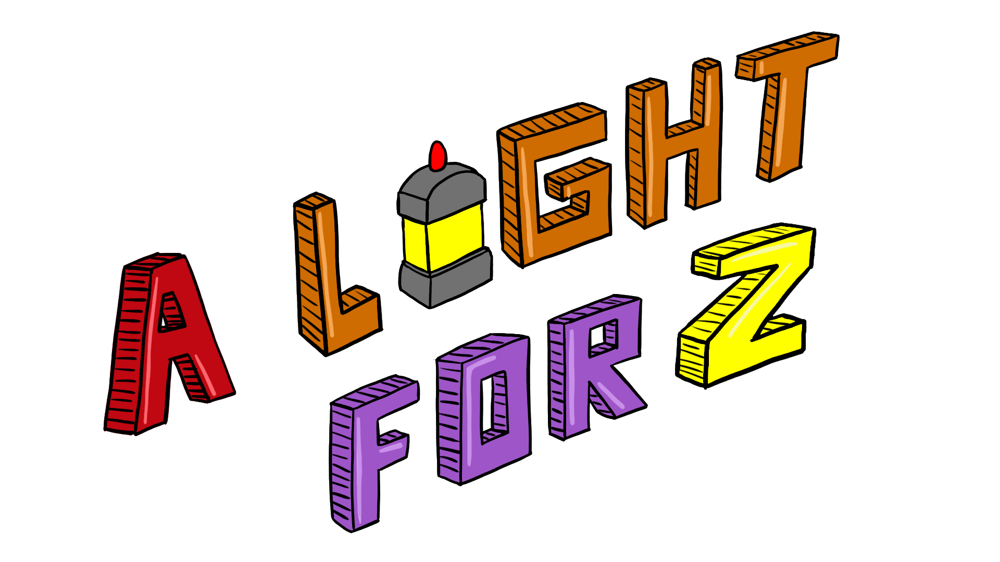
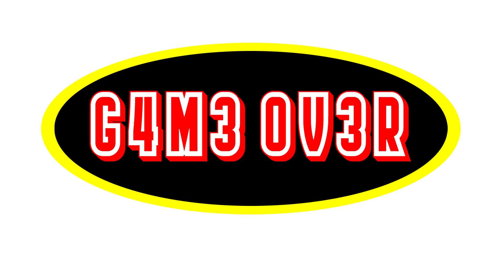
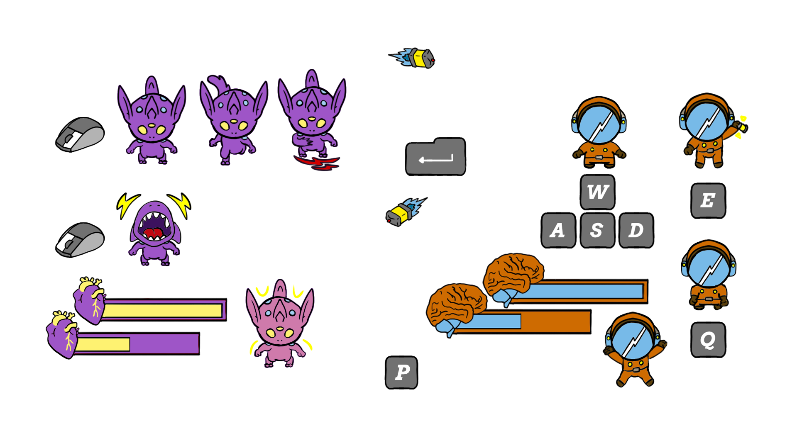
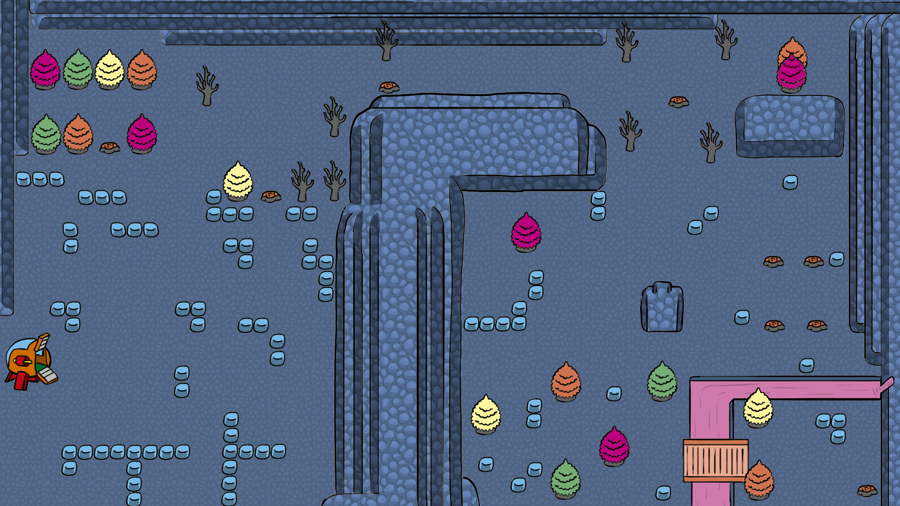

Juego desarrollado para la Global Game Jam 2022

Tema de la Jam: **Duality**

\*\* *Versión perfilada tras finalizar la Jam*
  

## Equipo: G4M3 0V3R

- Pep Mañas: @Neengash (Instagram, Github, itch.io)
- Jaume Riera: @xubecgames(itch.io, instagram)
- Daniel Ciero: @dcieroarts (Instagram)

|**Idea, mecánicas y montaje** | **Programación** | **Arte** |
| --- | --- | --- |
| Pep Mañas | Pep Mañas | Daniel Ciero |
| Jaume Riera | Jaume Riera | |
| Daniel Ciero | | |

  

## Juego: A Light For 2 

Juego cooperativo en el que un jugador con el teclado controlará al astronauta y el otro con el ratón controlará al alien. Deberán cooperar y pasarse la linterna principal para conseguir recuperar los cristales necesarios para reparar la nave.

  

### Ambientación

    ---Inicio de la transmisión---

    Comandante: Ash Troh
    Nave: G4-M3  0V-3R

    :::Cuaderno de bitácora espacial:::

    He recibido una señal de un planeta.
    Me dispongo a ver de dónde procede.

    **Entrando en la atmosfera**
    **Interferencias**
    **Aterrizaje forzoso**

    Parece ser que me he quedado sin combustible.
    Investigando un poco mi zona, he encontrado un huevo.
    Lo cuidaré a ver que sale. Tengo curiosidad.
    Un ser extraño ha salido del huevo, parece inofensivo.
    Tras unos días de cuidados mi nuevo compañero de vida parece ser que no me dañará.
    A-Lien me ha traído una especia de mineral, creo que podré utilizarlo cómo combustible.
    Es hora de buscar más minerales de esto y cargar mi nave para poder salir de aquí.
    A-Lien me sigue en esta aventura.
    Creo que me vendrá bien para defenderme de los suyos.

    ---Fin de la transmisión---